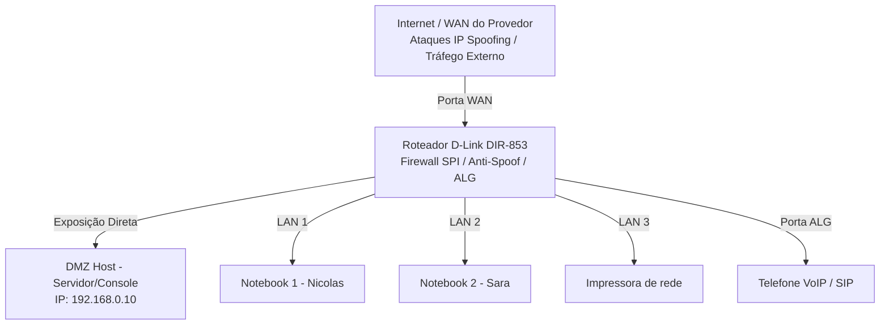

# Relatório de Laboratório: Segurança e Firewall
**Disciplina:** Redes de Computadores  
**Data:** 12 de março de 2026

  
   
  <em>Roteador utilizado no laboratório</em>

  
   
  <em>Interface de configuração de Firewall</em>

---

## Integrantes
*   **Alunos:** Nicolas Lopes, Sara Oliveira
*   **Professor:** José de Assis

---

## Equipamento Utilizado
*   **Roteador:** D-Link DIR-853 (AC1300 MU-MIMO)
*   **Objetivo:** Este documento descreve as funcionalidades de segurança e configurações de firewall baseadas na interface do roteador.

---

## 1. Configurações de Host e Firewall

### DMZ Host (Demilitarized Zone)
A DMZ permite expor um dispositivo da rede interna diretamente para a internet.
*   **Funcionamento:** Todo o tráfego que chega da internet e não possui regra específica é direcionado para um único IP interno.
*   **Exemplo:** Internet → Roteador → PC (192.168.0.10)
*   **Risco:** O dispositivo fica vulnerável, pois as proteções padrão do firewall são ignoradas.
*   **Uso comum:** Servidores de jogos, consoles de videogame e testes de rede.

### SPI IPv4 (Stateful Packet Inspection)
O SPI é um firewall que analisa o estado das conexões.
*   **Função:** Verifica se os pacotes de dados pertencem a uma sessão ativa e legítima.
*   **Operação:** Se um dispositivo interno solicita um site, o SPI permite o retorno. Se pacotes externos chegam sem terem sido solicitados, são bloqueados.

### Verificação Anti-Spoof
Protege a rede contra ataques de **IP Spoofing**.
*   **Conceito:** Ocorre quando um invasor falsifica o endereço IP de origem para parecer que o tráfego vem de uma fonte confiável.
*   **Ação:** O firewall valida a procedência do pacote e bloqueia identidades falsificadas.

### Segurança e Filtro IPv6
Aplica regras básicas de proteção para dispositivos que utilizam IPv6.
*   **Segurança Simples:** Bloqueia tentativas de conexões externas não solicitadas.
*   **Filtro de Entrada:** Mecanismo de controle de acesso que define quais tipos de conexões e protocolos podem atravessar a borda da rede.

---

## 2. Configurações do Firewall de Aplicações (ALG)
As configurações de **ALG (Application Layer Gateway)** ajudam o roteador a processar protocolos que normalmente apresentam dificuldades para atravessar o NAT.

*   **PPTP:** Protocolo para criação de túneis VPN (legado e com vulnerabilidades conhecidas).
*   **IPsec:** Conjunto de protocolos para comunicações seguras e criptografadas (VPN corporativa).
*   **RTSP:** Protocolo para controle de fluxos de dados multimídia (Câmeras IP e streaming).
*   **SIP:** Protocolo de sinalização para telefonia VoIP. *Nota: Frequentemente desativado em cenários de VoIP por causar falhas de sinalização.*

---

---

## 3. Tabela Comparativa de Protocolos ALG

| Opção | Aplicação Principal | Nível de Segurança |
| :---: | :---: | :---: |
| **PPTP** | VPN Antiga | Baixo |
| **IPsec** | VPN Moderna e Corporativa | Alto |
| **RTSP** | Streaming de Vídeo / Câmeras | N/A |
| **SIP** | Telefonia IP (VoIP) | N/A |

---

## 4. Conclusão
Neste laboratório foi possível analisar diversas configurações de segurança presentes em roteadores domésticos modernos. Foram estudados mecanismos importantes como o Firewall SPI, proteção contra IP Spoofing e o gerenciamento de protocolos através do ALG. A análise no **D-Link DIR-853** permitiu compreender, de forma prática, como roteadores implementam camadas básicas de proteção semelhantes às de redes profissionais.
